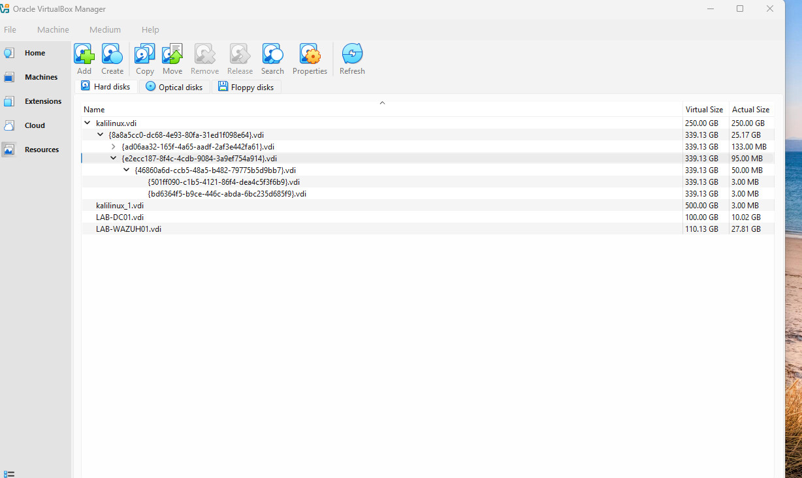
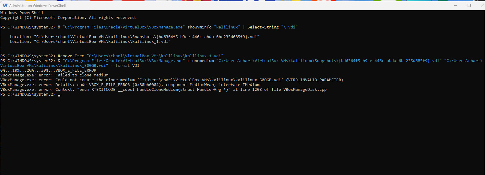
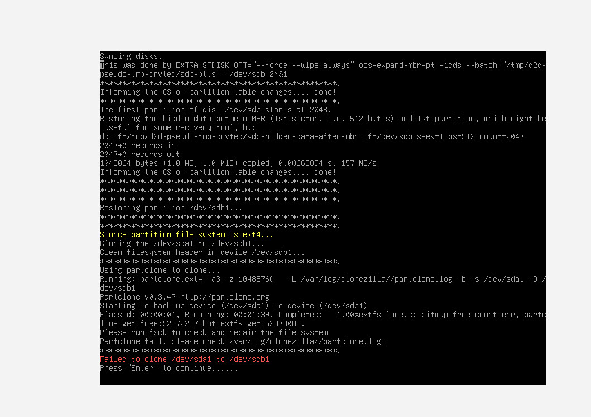
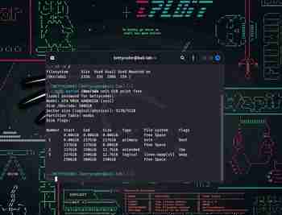
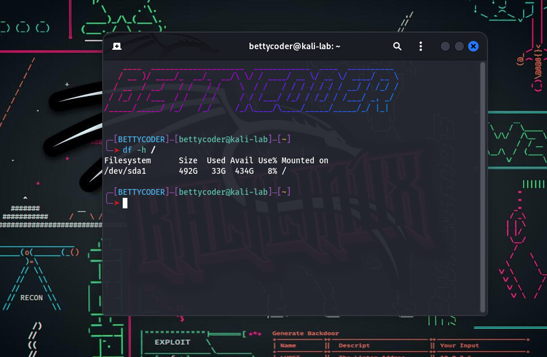

# Recovering and Expanding a Kali Linux VM in VirtualBox 7.2

## From a snapshot-chain mess to one clean 500 GB VDI

This walkthrough documents a real recovery of a Kali Linux VM that still booted normally, but could no longer be cleanly resized or cloned because its storage had become tied to a VirtualBox snapshot / differencing-disk chain.

The final result was a **standalone 500 GB VDI** that booted independently, preserved the original Kali installation, and exposed about **492 GB usable space with 434 GB free**.

> **Important:** This is a destructive disk-recovery procedure if the source and target disks are reversed. Read the safety section before running `dd` or deleting any VM, snapshot, partition, or VDI.

## Environment

- Host: Windows 11
- Hypervisor: Oracle VirtualBox 7.2
- Guest: Kali Linux
- Working source disk as seen by Linux: about 339 GiB
- Original root filesystem: about 233 GiB usable
- New destination disk: 500 GB dynamically allocated VDI
- Recovery media: Clonezilla Live

## What caused the problem

VirtualBox snapshots do not create a new independent copy of the whole disk. They use **differencing disk images** that depend on earlier disk states. A linked clone can add more dependencies.

In this case, VirtualBox showed a 250 GB base VDI with a larger differencing child, while Kali saw one working disk of about 339 GiB. The VM still booted because VirtualBox could assemble the chain, but normal clone/resize attempts were failing.

Oracle documents that a **Full Clone** copies dependent disk images and becomes independent, while a **Linked Clone** creates differencing disks tied to the source VM. See the references at the end of this guide.





## Safety rules used during recovery

1. **Do not delete the working source VM or snapshots until the replacement boots independently.**
2. **Do not boot Linux with both the original and cloned disk attached after a raw clone.** They initially contain duplicate filesystem identifiers and can confuse the guest OS.
3. Before every destructive disk operation, identify disks by **size and role**, not only by `/dev/sda` or `/dev/sdb`.
4. With `dd`, reversing `if=` and `of=` destroys the wrong disk.
5. Keep the source disk read-only in practice by avoiding repair, resize, or delete operations unless absolutely necessary.

---

# What we tried before Clonezilla

Clonezilla was not the first solution attempted. Several safer and more direct methods were tried first.

## 1. Verify what Kali and VirtualBox could actually see

Inside Kali, the disk layout was checked with tools including:

```bash
lsblk
sudo fdisk -l /dev/sda
```

Kali reported the working virtual disk as approximately **339.1 GiB**:

- `/dev/sda1`: approximately **237.3 GiB**, mounted as `/`
- `/dev/sda5`: approximately **12.7 GiB** swap
- Partition table: DOS / MBR

VirtualBox, however, showed a **250 GB base VDI** plus a larger snapshot differencing disk. This mismatch confirmed that Kali was booting from the assembled snapshot chain rather than directly from one simple standalone VDI.

## 2. Try resizing through VirtualBox

A normal VirtualBox disk resize was investigated first. This could enlarge the base image, but it could not safely flatten or replace the active snapshot chain. Increasing the VDI's advertised capacity also would not automatically enlarge Kali's partition and EXT4 filesystem.

Because the working state depended on a differencing disk, directly resizing the base VDI was not a complete or safe solution.

## 3. Try cloning through the VirtualBox interface

A normal VirtualBox clone was the first copy method attempted. The goal was to create a **Full Clone** with all dependent disk states merged into one independent disk.

The clone did not complete, so no verified standalone VM was produced.

## 4. Try PowerShell and VBoxManage

Administrator PowerShell and `VBoxManage` were then used to try creating a standalone VDI outside the graphical interface.

The planned output was:

```text
C:\Users\charl\VirtualBox VMs\kalilinux\kalilinux-standalone.vdi
```

The intended workflow was:

1. Clone the assembled virtual disk into a standalone VDI.
2. Resize the standalone VDI to 500 GB.
3. Attach it as the VM's main disk.
4. Boot it and expand the Linux partition and filesystem.

The clone/copy failed at approximately **30%** with:

```text
VERR_INVALID_PARAMETER
```



The VirtualBox clone was attempted twice and failed at roughly the same point both times. Repeating the same cloning operation was stopped to avoid wasting more time or risking the only working VM.

## 5. Try QEMU as an alternate route

QEMU was also tried as an alternative way to work with or convert the virtual disk outside VirtualBox.

That route did not produce a verified, standalone, bootable replacement for the working snapshot-chain disk, so it was abandoned rather than risking changes to the original data.

## Why we finally changed methods

At this point, the problem was clearly not simply a lack of allocated storage. The working Kali installation existed across a VirtualBox snapshot/differencing-disk chain, and both VirtualBox's graphical clone and command-line clone failed.

The recovery strategy therefore changed:

- Stop retrying VirtualBox cloning.
- Leave the original VM and snapshot chain intact.
- Boot an offline live environment.
- Let VirtualBox present the complete working chain as one source disk.
- Copy that assembled disk to a new empty 500 GB VDI.
- Boot and verify the new disk before deleting anything old.

This is why Clonezilla Live became the next step.

---

# Recovery Procedure

## 1. Attach Clonezilla Live

With the Kali VM powered off:

1. Open **Settings > Storage**.
2. Under the optical controller, select **Empty**.
3. Attach the Clonezilla Live ISO.


## 2. Create a clean 500 GB destination VDI

Create a new VDI named something unmistakable, for example:

```text
Kali-500-CLEAN.vdi
```

Settings used:

- VDI format
- 500.00 GB virtual size
- Dynamically allocated / **Pre-allocate Full Size unchecked**
- Split into 2 GB parts unchecked


Attach the new disk to the same VM temporarily so Clonezilla can see both the source and destination.


## 3. Boot Clonezilla Live

Boot the VM from the Clonezilla ISO.


The initial Clonezilla path was:

```text
English
Keep default keyboard layout
Start_Clonezilla
device-device
Beginner
disk_to_local_disk
```

Choose the **working 339.1 GiB disk as the source**.


Choose the **empty 500 GiB disk as the target**.


Clonezilla documents `-k1` for creating the destination partition table proportionally when cloning from a smaller disk to a larger disk.


## 4. Partclone failed with an EXT4 bitmap error

The first Clonezilla data-copy attempt did **not** complete. Partclone stopped with a filesystem bitmap error and instructed us to check the filesystem.


At this point, do not keep repeating the same failed clone.

From the Clonezilla command line, first confirm the source root partition is not mounted, then check the EXT4 filesystem offline:

```bash
findmnt /dev/sda1
sudo e2fsck -f /dev/sda1
```

`findmnt` returned no mounted entry for `/dev/sda1`, and `e2fsck` completed successfully.


## 5. Raw-copy the complete working disk with `dd`

Because VirtualBox was already presenting the snapshot chain to Linux as one complete working disk, a raw block copy could read that assembled disk and write it to the clean 500 GB VDI.

**Triple-check the direction before pressing Enter.**

In this recovery:

- `/dev/sda` = 339.1 GiB working Kali source
- `/dev/sdb` = 500 GiB empty destination

Command used:

```bash
sudo dd if=/dev/sda of=/dev/sdb bs=67108864 status=progress conv=fsync
```

Do not use these device names blindly on another system. Verify your own source and target first.


The command returned to the prompt after copying the complete source disk.




## 6. Boot-test the new disk by itself

After the raw copy completed:

1. Power off Clonezilla.
2. Remove the Clonezilla ISO from the optical drive.
   - In VirtualBox, first select the Clonezilla optical media so **Remove disk from virtual drive** becomes available.
   - Remove it, return to Clonezilla, then press Enter to finish shutdown.
3. Detach the **old source disk** from the VM.
4. Leave only `Kali-500-CLEAN.vdi` attached.
5. Boot Kali.

The clean disk booted successfully.

At this point, `df -h /` still showed only the old root filesystem size because `dd` copied the old partition table exactly.


## 7. Inspect the new 500 GB disk layout

Run:

```bash
sudo parted /dev/sda unit GiB print free
```

The layout showed:

- Kali root partition first
- old swap / extended partition after root
- about 250+ GiB of free space after that


The swap partition blocked the root partition from growing directly into the free space.

Check swap:

```bash
swapon --show
```


Disable swap:

```bash
sudo swapoff /dev/sda5
swapon --show
```

Back up `/etc/fstab`:

```bash
sudo cp /etc/fstab /etc/fstab.backup
```

Find the swap entry:

```bash
grep -i swap /etc/fstab
```

Comment out the old swap UUID entry before deleting the swap partition. In this specific recovery, the UUID was:

```text
414331eb-fd33-4711-abf1-8e0bc70ed822
```

Example command used:

```bash
sudo sed -i '/414331eb-fd33-4711-abf1-8e0bc70ed822/s/^/#/' /etc/fstab
```

**Use your own UUID. Do not copy this UUID into another system.**

Remove the old swap logical partition and then its now-empty extended container:

```bash
sudo parted /dev/sda rm 5
sudo parted /dev/sda rm 2
```

Verify that free space is now directly adjacent to partition 1:

```bash
sudo parted /dev/sda unit GiB print free
```




## 8. Resize the root partition offline

Do **not** resize the mounted root partition from the running Kali system.

Power Kali off, attach Clonezilla Live again, boot to its command-line shell, and run:

```bash
sudo parted /dev/sda resizepart 1 100%
```


Check the filesystem again before growing it:

```bash
sudo e2fsck -f /dev/sda1
```


Then expand the EXT4 filesystem to fill the enlarged partition:

```bash
sudo resize2fs /dev/sda1
```


Power off Clonezilla, remove the ISO, and boot Kali normally.

## 9. Verify the final result

Run:

```bash
df -h /
```

Final verified result:

```text
Filesystem      Size  Used Avail Use% Mounted on
/dev/sda1       492G   33G  434G   8% /
```




The 500 GB VDI was now bootable and independent, with approximately **492 GB usable** and **434 GB free**.

---

# Clean up the old VM safely

After the new VDI has booted successfully more than once:

1. Create a **fresh VirtualBox VM shell**.
2. Use **Linux > Debian (64-bit)** as the guest type for Kali.
3. Attach `Kali-500-CLEAN.vdi` as an **existing virtual hard disk**.
4. Match the desired RAM / CPU / network / shared-folder settings.
5. Boot the fresh VM shell and verify the disk again with `df -h /`.
6. Only after that verification should the old VM, snapshots, linked clones, and broken media entries be removed.

## Recommended backup strategy after recovery

A VirtualBox snapshot is not the same thing as an independent backup.

For a real fallback copy, use a **Full Clone**, not a Linked Clone. Oracle documents that a Full Clone copies dependent disk images and can operate independently from the source VM.

A practical setup is:

```text
Kali-500-CLEAN   -> daily working VM
Kali-500-BACKUP  -> powered-off Full Clone kept as recovery copy
```

Use snapshots only as short-lived rollback points, not as your only backup.

---

# What I learned

The original goal was simple: **increase Kali storage**.

The real lesson became much broader:

- VirtualBox snapshots are dependency chains, not independent backups.
- A VM can still boot even when its disk state is spread across base and differencing images.
- A failed Partclone operation does not automatically mean the guest data is lost.
- `e2fsck` should be run on an unmounted EXT filesystem when checking or repairing it.
- `dd` can bypass filesystem-aware cloning problems because it copies raw blocks, but it is extremely unforgiving if source and target are reversed.
- Expanding a virtual disk and expanding the guest partition/filesystem are separate tasks.
- Swap or other partitions can physically block root from extending into free space.
- The safest cleanup order is always **copy -> boot-test -> verify -> detach -> delete old state**.

Sometimes the best homelabs are the ones you accidentally build while trying to fix something else.

---

# References

- Oracle VirtualBox 7.2 User Guide: https://docs.oracle.com/en/virtualization/virtualbox/7.2/user/index.html
- Oracle VirtualBox 7.2 Virtual Storage: https://docs.oracle.com/en/virtualization/virtualbox/7.2/user/storage.html
- Oracle VirtualBox 7.2 Cloning VMs: https://docs.oracle.com/en/virtualization/virtualbox/7.2/user/working-with-vms.html
- Clonezilla official disk-to-disk guide: https://clonezilla.org/fine-print-live-doc.php?path=.%2Fclonezilla-live%2Fdoc%2F03_Disk_to_disk_clone%2F05-start-clonezilla-or-cmd.doc
- GNU Coreutils `dd`: https://www.gnu.org/software/coreutils/manual/html_node/dd-invocation.html
- `e2fsck` manual: https://man7.org/linux/man-pages/man8/e2fsck.8.html
- `resize2fs` manual: https://man7.org/linux/man-pages/man8/resize2fs.8.html

